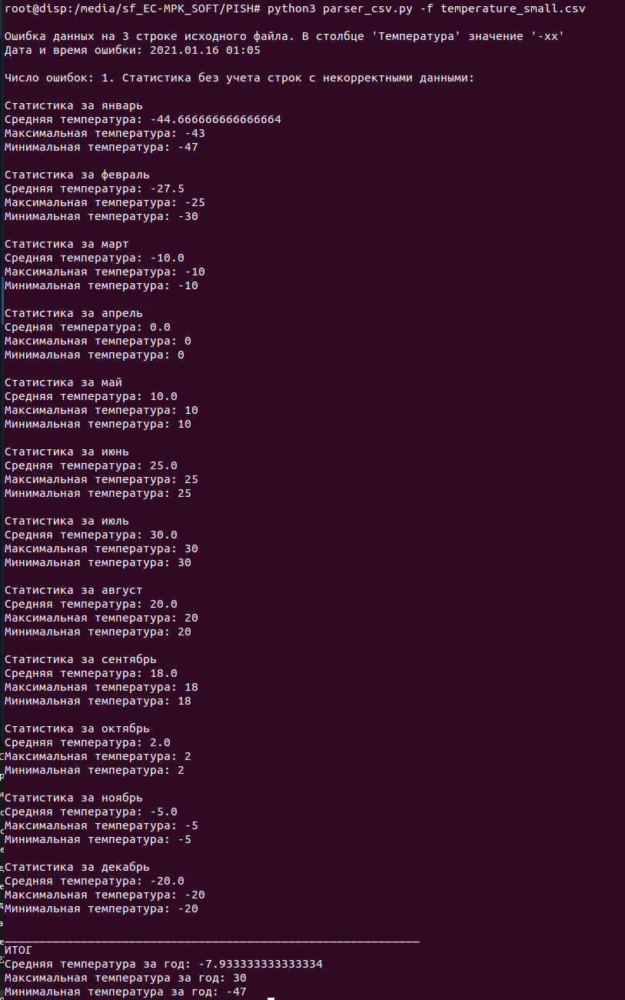
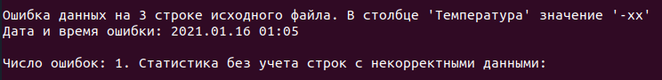
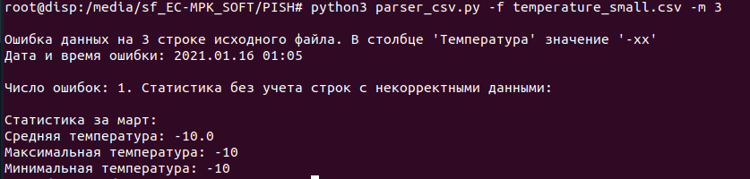
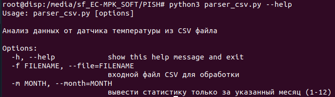

# Документация программы анализа температурных данных


## Корректная работа программы


### Обработка файла `temperature_small.csv`

**Описание:** На изображении показана успешная обработка CSV файла с температурными данными. Программа корректно:
- Считывает данные из указанного файла
- Выполняет валидацию значений температуры
- Выводит статистику по месяцам и общую за год

**Обработка ошибок**



**Вывод статистики за выбранный месяц**



**Вывод справки**


**Пример команды:**
```bash
python parcer_csv.py -f temperature_small.csv -m 3


